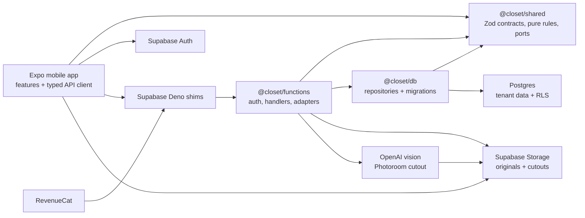
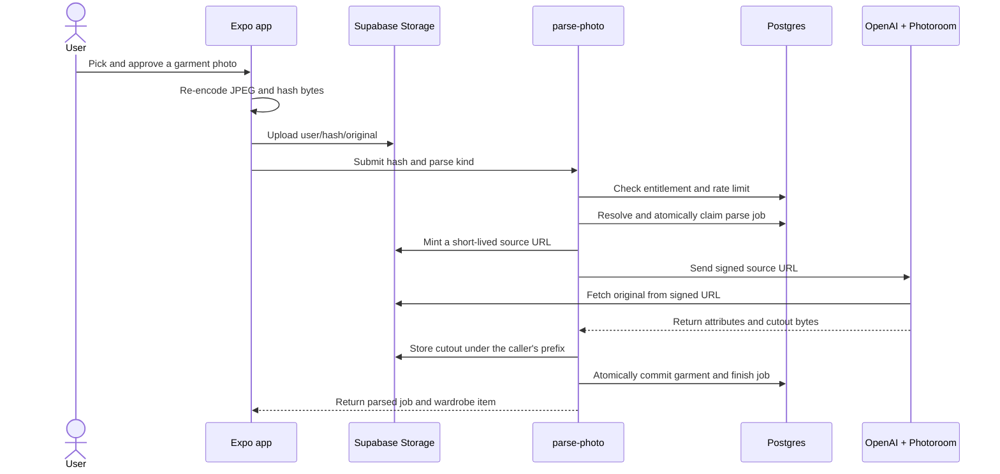

# Closet

Closet is an Expo/React Native wardrobe app for people who want to use the clothes they
already own more deliberately. It combines a visual closet, saved outfits, daily suggestions,
wear history, laundry state, a self-selected color palette, and subscription-aware photo
processing in one TypeScript monorepo.

The repository is an actively developed prototype, not a deployed service. Most wardrobe
management screens can be inspected through a backend-free simulator harness whose mutations
are intentionally non-persistent. The repository contains 15 mobile API handlers and a
webhook, but the production add-garment flow is currently blocked before upload because no
on-device classifier produces the required `candidate` verdict. See
[Current scope](#current-scope).

## Product workflow

| Step | What the app does | Current state |
| --- | --- | --- |
| Sign in | Uses Apple or Google credentials with Supabase Auth | Implemented; provider configuration required |
| Add clothing | Picks photos, re-encodes them as JPEGs, asks for explicit approval, then uploads and parses them | UI and pipeline exist; production approval is blocked by the missing classifier |
| Organize | Shows a windowed cutout grid with category and availability filters | Implemented |
| Clean up | Finds likely duplicates from perceptual hashes and lets the user keep both or merge one | Implemented |
| Decide | Builds an on-device daily suggestion from wearable items, recent wears, warmth, color harmony, and the user's palette | Implemented; temperature is currently fixed at 18 C |
| Save looks | Builds slot-based outfits, including dress versus top/bottom exclusivity, then supports rename and delete | Implemented |
| Track use | Logs every piece in a worn look and moves it into the wash | Implemented |
| Reset laundry | Marks one garment or a selected batch as clean | Implemented |
| Manage the account | Shows membership state, restores purchases, exports account data, and provides type-to-confirm deletion | Implemented with limitations noted below |

The main mobile surfaces are composed in
[`packages/mobile/src/App.tsx`](packages/mobile/src/App.tsx): **Closet**, **Today**,
**Outfits**, and **You**, with contextual Add, Laundry, and Paywall screens.

## Architecture

The codebase keeps contracts and business rules independent from runtimes. Mobile imports
`@closet/shared`, but not the database or function packages. Edge handlers reach Postgres only
through repositories in `@closet/db`.



Authenticated handlers verify JWTs with `jose`, take tenant identity from the verified `sub`,
and execute repository queries as `app_user`. The migrations enable and force row-level
security on tenant tables. The RevenueCat webhook is the separate system path: it authenticates
the sender, deduplicates and orders events, and applies entitlement changes through a
service-role executor.

### Photo parse path

The following server path is implemented and covered by local tests. The first approval step
does not complete with the current production photo adapter because the on-device classifier is
absent.



Idempotent job resolution, teaser limits, a DB-backed spend limiter, single-winner claims,
provider timeouts/retries, replay, and atomic commit live in
[`packages/functions/src/parse/parse-photo.ts`](packages/functions/src/parse/parse-photo.ts)
and [`packages/db/src/repos/parse-jobs.repo.ts`](packages/db/src/repos/parse-jobs.repo.ts).

## Technology

| Area | Choice | Why it matters here |
| --- | --- | --- |
| Mobile | Expo 57, React Native 0.86, React 19 | One iOS/Android codebase with native auth, photo, and crypto integrations; purchase configuration is currently iOS-only |
| Server state | TanStack Query | Centralizes typed reads, mutation state, pagination, and cache invalidation |
| Contracts | TypeScript strict, Zod | Shared domain and row schemas underpin most boundaries; local envelopes cover package-specific responses |
| Backend | Supabase Auth, Storage, Postgres, Edge Functions | Provides JWT identity, private object storage, relational data, and Deno deployment |
| Data access | Repository factories and ordered SQL migrations | Keeps SQL out of handlers and makes schema/RLS changes reviewable |
| External services | RevenueCat, OpenAI vision, Photoroom | Purchases and image processing sit behind narrow adapters rather than leaking vendor types |
| Verification | Vitest, fast-check, Testcontainers | Supports pure, property-based, real-Postgres integration, and performance test lanes |

## Repository map

| Path | Responsibility |
| --- | --- |
| `packages/shared` | Zod schemas, pure suggestion/color/dedupe logic, and provider ports |
| `packages/db` | Eighteen migrations plus repositories; the only application database seam |
| `packages/functions` | Runtime-independent Edge handlers, JWT auth, and provider adapters |
| `packages/mobile/src` | Composition root, API client, session, billing, photo, storage, tokens, and shared UI |
| `packages/mobile/features` | Auth, wardrobe, onboarding, suggestions, outfits, laundry, palette, and monetization surfaces |
| `packages/mobile/harness` | Signed-in fake backend and ports for simulator exploration without Supabase |
| `supabase/functions` | Thin Deno entry points for 15 mobile routes and the RevenueCat webhook |
| `docs` | Product requirements, engineering decisions, testing model, deployment notes, and UI evidence |
| `scripts` | Convention generation, verification wall, migration runner, and structural gates |

## Getting started

### Prerequisites

- Node.js 22 or newer (`.mise.toml` pins Node 22)
- pnpm 9.15.0
- A Docker-compatible container runtime for `verify:full`, integration, and performance tests
- Xcode and CocoaPods for the repository's verified iOS development-client path

Install the workspace:

```bash
pnpm install
```

### Explore without a backend

Expo Go cannot load this project because it uses custom native modules. Native projects are
generated and gitignored. On a fresh clone, generate and build the iOS development client:

```bash
pnpm --dir packages/mobile exec expo prebuild --platform ios
EXPO_PUBLIC_HARNESS=1 pnpm --dir packages/mobile exec expo run:ios
```

For later sessions, the harness uses the real screens and typed API client with schema-valid
canned responses, fake auth, fake billing, and fake photo ports:

```bash
pnpm --filter @closet/mobile start:harness
```

Metro starts on port `8081`. Mutations return valid response shapes but do not persist after a
refetch. To exercise the non-member state, start with `EXPO_PUBLIC_HARNESS_FREE=1`.

### Run the configured mobile app

Start from the checked-in public-value template:

```bash
cp packages/mobile/.env.example packages/mobile/.env
pnpm --filter @closet/mobile start
```

At minimum, set `EXPO_PUBLIC_SUPABASE_URL`, `EXPO_PUBLIC_SUPABASE_ANON_KEY`, and
`EXPO_PUBLIC_FUNCTIONS_BASE_URL`. Apple/Google sign-in, RevenueCat, and legal/support links
need additional provider values used by `packages/mobile/src`; the current template does not
enumerate all of them.

There is no one-command local backend bootstrap. Hosted Supabase setup requires separate app
and service database identities, migrations, private Storage buckets, Edge secrets, built Deno
shims, and deployment preflight. [`docs/DEPLOY-RUNBOOK.md`](docs/DEPLOY-RUNBOOK.md) records the
intended sequence, but it is not currently executable as written: its route, migration, and
runtime-variable inventory predates the current source. In particular, `.env.example` and the
runbook do not yet account consistently for the `JWT_ISSUER` and `JWT_AUDIENCE` values required
by `withAuth`. Reconcile those files with the current shims and handlers before deploying.

## Verification

```bash
pnpm verify         # generated-file drift, structural gates, typecheck, lint, unit tests
pnpm verify:full    # adds RLS checks, Testcontainers integration, parse-corpus replay
pnpm test:perf      # separate real-Postgres performance lane
```

Practices present in the repository include:

- real Postgres integration tests over the full migration chain;
- explicit `app_user` execution and cross-tenant refusal checks;
- property-based and metamorphic tests for deterministic domain logic;
- idempotency and concurrency tests for parse jobs, writes, and webhook application;
- compile-time fixtures and source-level checks around the single approved-photo upload seam;
- replay, stale-event, and failure-path coverage for RevenueCat entitlement updates;
- a backend-free simulator harness and checked-in iOS screenshot evidence.

These are local gates. The repository does not contain a CI workflow, and local integration
coverage is not evidence that hosted Supabase, live image providers, or a real RevenueCat
delivery have been exercised.

## Current scope

- **Photo intake is not end-to-end usable in the production adapter.** Hand-picked photos are
  currently marked `undetermined`; `approvePhoto()` only mints an uploadable `ApprovedPhoto`
  for `candidate`. The system therefore fails before upload until a classifier and its
  independent recall corpus exist. The picker also re-encodes photos as JPEGs with the intent
  of removing EXIF/GPS metadata, but the uploaded device bytes have not yet been independently
  checked for an EXIF marker.
- **Suggestions are not weather-aware yet.** The implemented heuristic uses a fixed 18 C input.
- **Only teaser parsing is submitted by mobile.** There is no UI flow that starts a
  post-entitlement full-library parse.
- **External verification remains.** The OpenAI/Photoroom path, hosted Storage RLS and preflight,
  and a real RevenueCat webhook delivery are not proven by checked-in evidence.
- **RevenueCat client configuration is currently iOS-only.** The mobile adapter reads
  `EXPO_PUBLIC_REVENUECAT_IOS_KEY`; an Android key path is not implemented.
- **Account deletion is partial.** It removes the caller's Postgres rows, but the handler does
  not delete Supabase Auth identity or Storage objects. Data export includes Storage paths, not
  image bytes.
- **The app is not deployed from this repository.** Existing simulator captures use the local
  harness and canned data.

The forward-looking product material lives in [`docs/roadmap.md`](docs/roadmap.md); it should
not be read as implemented behavior.
